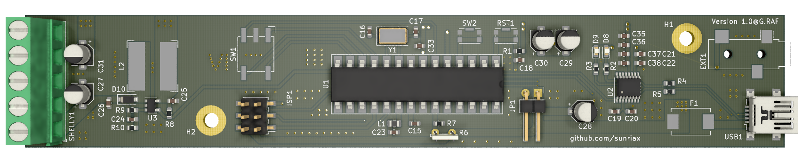

    

# Controllable Lamp (Signal) over Wireless LAN ([Shelly](https://shop.shelly.cloud/shelly-1-wifi-smart-home-automation#50))

## Project description

The PCB (lamp) can be controlled over a [Shelly](https://shop.shelly.cloud/shelly-1-wifi-smart-home-automation#50) wireless LAN module. It is attached to the PCB and can be controlled over the [Web Control](https://sunriax.github.io/lamp/) interface or any other software. Currently the lamp is designed for alerting. It changes the color within a given time. The lamp can be configured over the [Lamp Control](https://github.com/sunriax/lamp/releases/download/v1.0/Lamp.zip) application. Also the attached PC can be informed that an alert (over wireless LAN) occurrs. The current firmware can be downloaded [here](https://github.com/sunriax/lamp/releases/download/v1.0-Firmware/Firmware.zip). An ISP programmer for ATmega8 is necessary to flash the firmware onto the PCB.

## Project status

### Application

| Program     | Status |
|-------------|--------|
| Web Control |  |
| Application |  |
|             |  |
| Firmware    |  |

### Schematic/PCB

| Board | Status |
|-------|:------:|
| [Schematic](https://cadlab.io/project/23814/main/circuit/cGNiL3BjYi5zY2g%3D) | ✔️ Done |
| [Board](https://cadlab.io/project/23814/main/circuit/cGNiL3BjYi5raWNhZF9wY2I%3D) | ✔️ Done |
| [Partlist](partlist.csv) | ✔️ Done |
| Production | ✔️ Done |
| [Assembly](pcb_assembled.png) | ✔️ Done |
| Case | ❌ Open |
